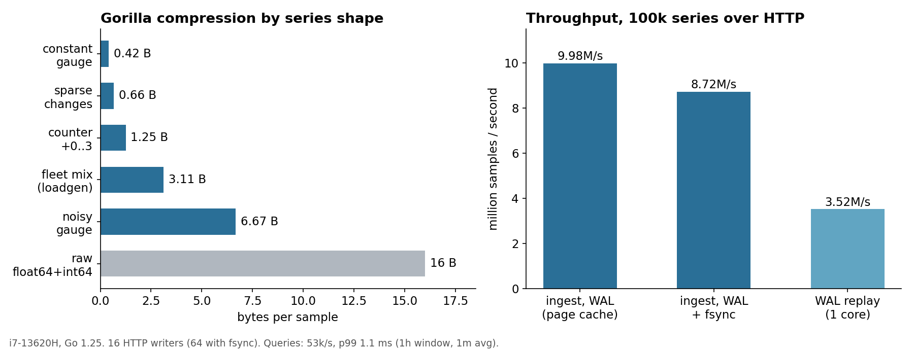

# tsdb-gorilla

In-memory time-series database in Go with Gorilla compression, a group-commit
write-ahead log and an InfluxDB-style ingest API. Built to answer one question:
how many samples per second can a single Go process accept durably, and how small
can they be kept in RAM.



| | |
|---|---|
| Ingest over HTTP, WAL on | **~10.0M samples/s** (6.4k requests/s, p99 16 ms) |
| Ingest with fsync per group commit | **8.7M samples/s** |
| Memory per sample | **3.1 bytes** on a realistic fleet mix, 0.4–1.3 bytes for counters and flat gauges (raw is 16) |
| Aggregating queries (1 h, 1 min avg) | **53k/s**, p99 1.1 ms |
| Crash recovery | 200M samples / 3.6 GB WAL replayed in 57 s |

Numbers from `cmd/loadgen` against `cmd/server` on one laptop (i7-13620H):
10 000 hosts x 10 metrics = 100 000 series, 200M samples in 20 s.

## How it works

```
 HTTP /write ─┐                    ┌─► WAL writer goroutine ── one write(2) + one fsync per batch
 UDP :8089  ──┼─► body ── Write ───┘        (up to 512 requests merged)
              │
              └─► lineproto.Parser (0 allocs) ──► store: 256 shards ─► Series
                                                                      ├ sealed chunks (immutable, 120 samples)
                                                                      └ head encoder (Gorilla, mutable)
```

**Compression** (`internal/gorilla`). Timestamps are stored as delta-of-delta with
four variable-width buckets, so a steady scrape interval costs 1 bit per sample.
Values are XORed with the previous value; unchanged values cost 1 bit, and when the
meaningful bits fit the previous window only the middle bits are written. Encoding
takes 14 ns and decoding 22 ns per sample. Round-trip is property-tested on random
streams including NaN, Inf and 2^40 ms gaps, plus every bucket boundary.

**Storage** (`internal/store`). Series live in 256 shards keyed by `maphash`, so
writers on different series never share a lock. Every 120 samples the head chunk is
sealed and shrunk to fit. Readers copy only the head under the series lock and decode
sealed chunks lock-free. Parallel append costs 48 ns with zero allocations.

**Durability** (`internal/wal`). A request is acknowledged only after its bytes are in
the WAL. A single writer goroutine drains the queue, so under load one fsync covers
dozens of requests: that is why fsync mode loses only 13 % of throughput. Records are
`len | crc32c | payload`; a torn tail from a crash is detected and truncated on
replay. Segments rotate at 64 MB and are deleted once they fall out of retention.

**Queries**. `raw`, `avg`, `min`, `max`, `sum`, `count`, `last` and `rate` over
step-aligned windows. `rate` handles counter resets the same way Prometheus does.
Aggregates are checked against a naive implementation in tests.

## API

```bash
# write: InfluxDB line protocol, timestamps in ms (optional, defaults to now)
curl -X POST localhost:8428/write --data-binary \
  'host,dc=eu,id=web1 cpu_user=12.5,http_requests=18231i 1727700000000'

# query: 1-minute averages over the last hour
curl 'localhost:8428/query?series=host.cpu_user{dc=eu,id=web1}&step=60000&agg=avg'

curl 'localhost:8428/series?prefix=host.cpu&limit=20'
curl localhost:8428/stats      # series, bytes per sample, rejected, dropped
curl localhost:8428/metrics    # Prometheus: ingest counters, write and query latency histograms
```

Each numeric field becomes its own series named `measurement.field{sorted tags}`.
Out-of-order and duplicate timestamps are rejected and counted.

## Run

```bash
make run                          # server on :8428, UDP on :8089, WAL in data/wal
make load                         # 100k series load test, then query phase
make test && make bench
docker build -t tsdb-gorilla . && docker run -p 8428:8428 -v tsdb:/data tsdb-gorilla
```

Flags: `-fsync` for fsync on every group commit, `-retention 24h`, `-wal ""` for a
purely in-memory run.

## Layout

```
cmd/server      HTTP + UDP ingest, queries, retention janitor, WAL pruning, Prometheus metrics
cmd/loadgen     fleet simulator: gauges, counters, rare errors; write and query phases
internal/gorilla   bit stream, encoder, iterator
internal/store     sharded series map, chunks, aggregation, retention
internal/lineproto zero-allocation line protocol parser
internal/wal       segmented group-commit WAL with torn-write recovery
```

## Trade-offs and next steps

- Replay is single-threaded (3.5M samples/s). Periodic snapshots of sealed chunks
  would bound restart time independently of WAL size.
- The WAL stores raw line protocol, which is simple and debuggable but about
  6x larger than the in-memory form; compressing segments with zstd is a small change.
- Queries address one series at a time. Label matchers across series would need an
  inverted index from label pairs to series IDs.
